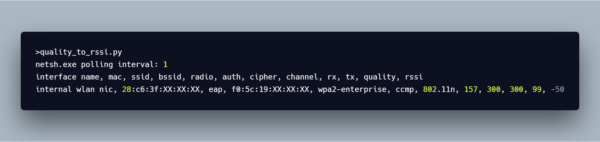
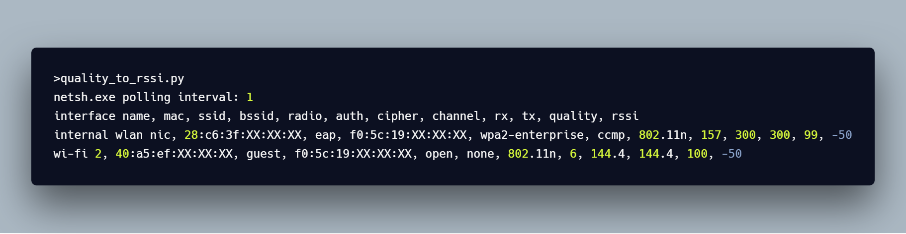

# monitornetsh (experimental, i do not recommend to use this)

monitornetsh.py monitors netsh.exe's `netsh wlan show interfaces` output to show connected WLAN information. It includes the conversion of signal quality to an **estimated** Received Signal Strength Indicator (RSSI) value. 

# status

abandoned

# known issues

1. this script scrapes `netsh`
    - this script completely relies on the output of `netsh wlan show interfaces`.

2. `netsh` does not force a scan or a refresh of results
    - `netsh wlan ...` relies on cached scan results and does not trigger scans.
    - this means signal quality and calculated RSSI will be delayed until some event triggers a scan.
        + for example, you can manually force a refresh of scan results by clicking on the Wi-Fi network icon in the toolbar.

3. rssi calculated in this way will never be greater than -50
    - the signal quality metric found in the output is a qualitative metric. 
    - this script uses linear interpolation to convert signal quality to RSSI, thus an arbitrary metric.

## conversion formula

with that said, the conversion for signal quality (percentage) to RSSI (dBm) is based on how `wlanSignalQuality` is calculated from [wlanapi.h](https://docs.microsoft.com/en-us/windows/desktop/api/wlanapi/ns-wlanapi-_wlan_association_attributes).

> A percentage value that represents the signal quality of the network. `WLAN_SIGNAL_QUALITY` is of type ULONG. This member contains a value between 0 and 100. A value of 0 implies an actual RSSI signal strength of -100 dbm. A value of 100 implies an actual RSSI signal strength of -50 dbm. You can calculate the RSSI signal strength value for wlanSignalQuality values between 1 and 99 using linear interpolation.

here is the pseudo code for how this script calculates RSSI from signal quality:

```
// signal quality to RSSI
if(quality <= 0)
  rssi = -100;
else if(quality >= 100)
  rssi = -50;
else
  rssi = (quality / 2) - 100;
```

this pseudo code shows this script cannot calculate RSSI better than -50. for this reason, and the known issues, this script is likely not what you want to use. 

you may be looking for a RSSI value reported by the driver such as available from the [wlanapi](https://docs.microsoft.com/en-us/windows/desktop/api/wlanapi/).

if you are after the RSSI value reported by the driver, consider using [WinFi](http://www.helge-keck.com/) by [Helge Keck](https://twitter.com/HelgeKeck).

# requirements

a microsoft windows machine with Python v3.0+ installed.

tested with Python 3.6.4 and Windows 10 Enterprise (10.0.16299 N/A Build 16299).

# usage

by default the script will poll `netsh.exe` every second. use the `--interval` argument to change this. 

script will create subfolder in the current directory called `log` where you will find rotating log files.

# sample output

```
>monitornetsh.py
netsh.exe polling interval: 1
interface name, mac, ssid, bssid, radio, auth, cipher, channel, receive, transmit, quality, rssi
[20181217t085334]:Internal WLAN NIC, 28:c6:3f:XX:XX:XX, eap, f0:5c:19:XX:XX:XX, WPA2-Enterprise, CCMP, 802.11n, 157, 300, 300, 99, -50
```

## 1 nic



## multiple nics (experimental)



# credits

- [this stackoverflow answer](https://stackoverflow.com/questions/15797920/how-to-convert-wifi-signal-strength-from-quality-percent-to-rssi-dbm) 
- [microsoft's wlanapi](https://docs.microsoft.com/en-us/windows/desktop/api/wlanapi/) 

# license

project license can be found [here](https://github.com/joshschmelzle/netsh_quality_to_dbm/blob/master/LICENSE).
